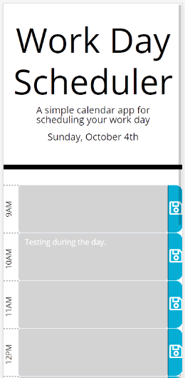
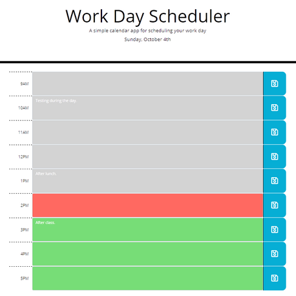

# Work_Day_Scheduler
This app is an online calendar application that allows the user to plan, record and save events that occur throughout the work day. 

The app is written using HTML, CSS, jQuery, Bootstrap, and the [Moment.js](https://momentjs.com/) library.

Here are samples of the interface on devices of different sizes.  

## Usage
Simply click on the textarea in one of the time blocks, enter your event, and click on the save button. If you navigate away from the page, and come back, your events will be retrieved from localStorage. The time blocks are also colour-coded so that blocks in the past are coloured grey, blocks in the future are coloured lime green, while the current hour has a salmon hue.

## Try it
You can try the application [here](https://cek333.github.io/Work_Day_Scheduler/).
